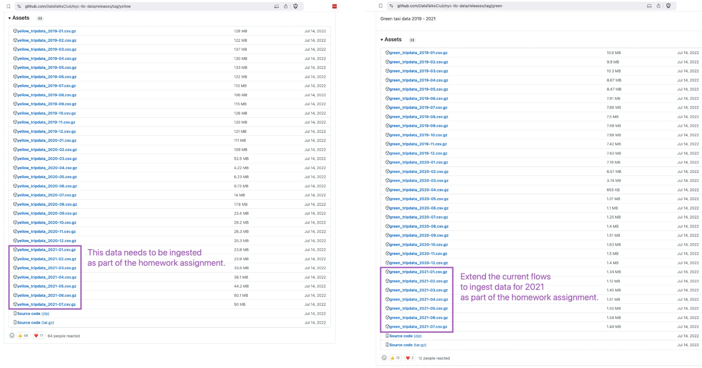
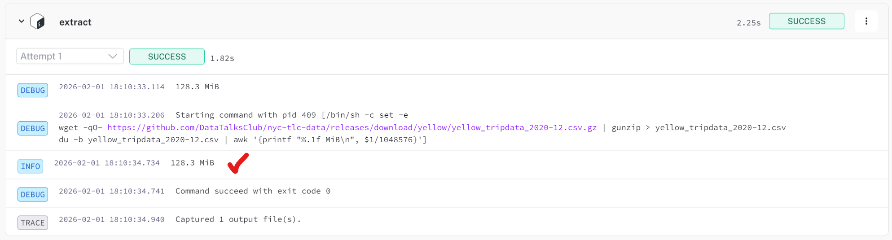
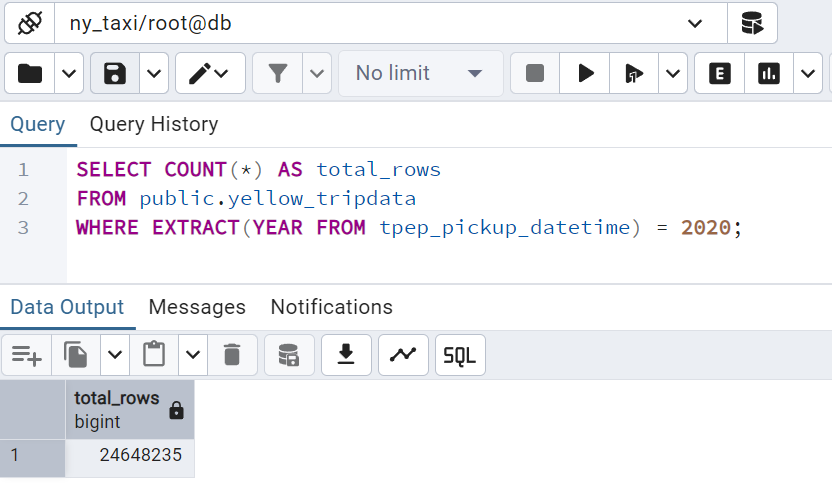
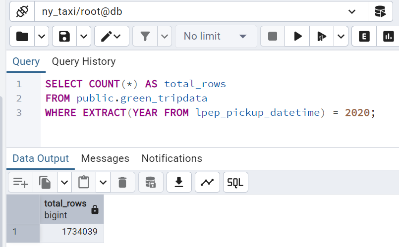
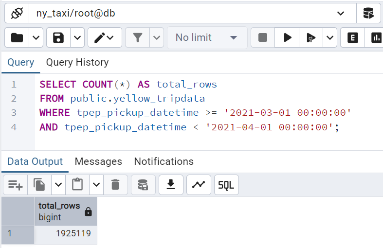

## Module 2 Homework

For the homework, we'll be working with the _green_ taxi dataset located here:

`https://github.com/DataTalksClub/nyc-tlc-data/releases/tag/green/download`

To get a `wget`-able link, use this prefix (note that the link itself gives 404):

`https://github.com/DataTalksClub/nyc-tlc-data/releases/download/green/`

### Assignment

So far in the course, we processed data for the year 2019 and 2020. Your task is to extend the existing flows to include data for the year 2021.



As a hint, Kestra makes that process really easy:
1. You can leverage the backfill functionality in the [scheduled flow](../../../02-workflow-orchestration/flows/09_gcp_taxi_scheduled.yaml) to backfill the data for the year 2021. Just make sure to select the time period for which data exists i.e. from `2021-01-01` to `2021-07-31`. Also, make sure to do the same for both `yellow` and `green` taxi data (select the right service in the `taxi` input).
2. Alternatively, run the flow manually for each of the seven months of 2021 for both `yellow` and `green` taxi data. Challenge for you: find out how to loop over the combination of Year-Month and `taxi`-type using `ForEach` task which triggers the flow for each combination using a `Subflow` task.

### Quiz Questions

Complete the quiz shown below. It's a set of 6 multiple-choice questions to test your understanding of workflow orchestration, Kestra, and ETL pipelines.

1) Within the execution for `Yellow` Taxi data for the year `2020` and month `12`: what is the uncompressed file size (i.e. the output file `yellow_tripdata_2020-12.csv` of the `extract` task)?
- 128.3 MiB
- 134.5 MiB
- 364.7 MiB
- 692.6 MiB

    #### **Answer of Question 1**

    We need additional command to see the file size (in MB):

    ``` yaml
    - id: extract
        type: io.kestra.plugin.scripts.shell.Commands
        outputFiles:
        - "*.csv"
        taskRunner:
        type: io.kestra.plugin.core.runner.Process
        commands:
        - wget -qO- https://github.com/DataTalksClub/nyc-tlc-data/releases/download/{{inputs.taxi}}/{{render(vars.file)}}.gz | gunzip > {{render(vars.file)}}
        # Additional command to see file list and size:
        - du -b {{render(vars.file)}} | awk '{printf "%.1f MiB\n", $1/1048576}'
    ```

    The result in Kestra Logs:
    

    The answer is **128.3 MiB**

2) What is the rendered value of the variable `file` when the inputs `taxi` is set to `green`, `year` is set to `2020`, and `month` is set to `04` during execution?
- `{{inputs.taxi}}_tripdata_{{inputs.year}}-{{inputs.month}}.csv` 
- `green_tripdata_2020-04.csv`
- `green_tripdata_04_2020.csv`
- `green_tripdata_2020.csv`

    #### **Answer of Question 2**

    Based on the expressed variables in file: `{{inputs.taxi}}_tripdata_{{inputs.year}}-{{inputs.month}}.csv`
    - `{{inputs.taxi}}` = the taxi type (for this case is `green`)
    - `tripdata` is a default
    - `{{inputs.year}}` = year of the taxi data (for this case is `2020`)
    - `{{inputs.month}}` = month of the taxi data (for this case is `04`)

    The answer is **`green_tripdata_2020-04.csv`**

3) How many rows are there for the `Yellow` Taxi data for all CSV files in the year 2020?
- 13,537.299
- 24,648,499
- 18,324,219
- 29,430,127

    #### **Answer of Question 3**

    After required dataset loaded in PostgresSQL, run this query :
    ```sql
    SELECT COUNT(*) AS total_rows
    FROM public.yellow_tripdata 
    WHERE EXTRACT(YEAR FROM tpep_pickup_datetime) = 2020;
    ```

    The result is 24,648,235 rows:

    

    The closest answer is **24,648,499** rows

4) How many rows are there for the `Green` Taxi data for all CSV files in the year 2020?
- 5,327,301
- 936,199
- 1,734,051
- 1,342,034

    #### **Answer of Question 4**

    After required dataset loaded in PostgresSQL, run this query :
    ```sql
    SELECT COUNT(*) AS total_rows
    FROM public.green_tripdata 
    WHERE EXTRACT(YEAR FROM lpep_pickup_datetime) = 2020;
    ```

    The result is 1,734,039 rows:
    
    

    The closest answer is **1,734,051** rows

5) How many rows are there for the `Yellow` Taxi data for the March 2021 CSV file?
- 1,428,092
- 706,911
- 1,925,152
- 2,561,031

    #### **Answer of Question 5**

    After required dataset loaded in PostgresSQL, run this query :
    ```sql
    SELECT COUNT(*) AS total_rows
    FROM public.yellow_tripdata
    WHERE tpep_pickup_datetime >= '2021-03-01 00:00:00'
    AND tpep_pickup_datetime < '2021-04-01 00:00:00';
    ```

    The result is 1,925,119 rows:

    

    The closest answer is **1,925,152** rows

6) How would you configure the timezone to New York in a Schedule trigger?
- Add a `timezone` property set to `EST` in the `Schedule` trigger configuration  
- Add a `timezone` property set to `America/New_York` in the `Schedule` trigger configuration
- Add a `timezone` property set to `UTC-5` in the `Schedule` trigger configuration
- Add a `location` property set to `New_York` in the `Schedule` trigger configuration  

    #### Answer of Question 6

    The timezone trigger would be placed here in flow code

    ```yaml
    triggers:
        - id: green_schedule
            type: io.kestra.plugin.core.trigger.Schedule
            cron: "0 9 1 * *"
            timezone: America/New_York # Configure timezone to NY
            inputs:
                taxi: green

        - id: yellow_schedule
            type: io.kestra.plugin.core.trigger.Schedule
            cron: "0 10 1 * *"
            timezone: America/New_York # Configure timezone to NY
            inputs:
                taxi: yellow
    ```
    Source: https://kestra.io/docs/workflow-components/triggers/schedule-trigger

    The answer is "**Add a `timezone` property set to `America/New_York` in the `Schedule` trigger configuration**"
