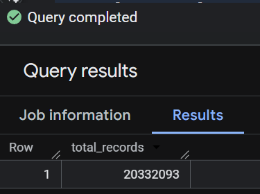
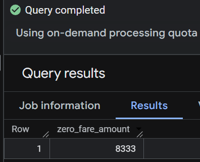

# Module 3 Homework: Data Warehousing & BigQuery

In this homework we'll practice working with BigQuery and Google Cloud Storage.

When submitting your homework, you will also need to include
a link to your GitHub repository or other public code-hosting
site.

This repository should contain the code for solving the homework.

When your solution has SQL or shell commands and not code
(e.g. python files) file format, include them directly in
the README file of your repository.

## Data

For this homework we will be using the Yellow Taxi Trip Records for January 2024 - June 2024 (not the entire year of data).

Parquet Files are available from the New York City Taxi Data found here:

https://www.nyc.gov/site/tlc/about/tlc-trip-record-data.page

## Loading the data

You can use the following scripts to load the data into your GCS bucket:

- Python script: [load_yellow_taxi_data.py](./load_yellow_taxi_data.py)
- Jupyter notebook with DLT: [DLT_upload_to_GCP.ipynb](./DLT_upload_to_GCP.ipynb)

You will need to generate a Service Account with GCS Admin privileges or be authenticated with the Google SDK, and update the bucket name in the script.

If you are using orchestration tools such as Kestra, Mage, Airflow, or Prefect, do not load the data into BigQuery using the orchestrator.

Make sure that all 6 files show in your GCS bucket before beginning.

Note: You will need to use the PARQUET option when creating an external table.

## BigQuery Setup

Create an external table using the Yellow Taxi Trip Records. 

Create a (regular/materialized) table in BQ using the Yellow Taxi Trip Records (do not partition or cluster this table). 

## Question 1. Counting records

What is count of records for the 2024 Yellow Taxi Data?
- 65,623
- 840,402
- 20,332,093
- 85,431,289

### **Answer of Question 1**

The answer is **On Progress**

## Question 2. Data read estimation

Write a query to count the distinct number of PULocationIDs for the entire dataset on both the tables.
 
What is the **estimated amount** of data that will be read when this query is executed on the External Table and the Table?

- 18.82 MB for the External Table and 47.60 MB for the Materialized Table
- 0 MB for the External Table and 155.12 MB for the Materialized Table
- 2.14 GB for the External Table and 0MB for the Materialized Table
- 0 MB for the External Table and 0MB for the Materialized Table

### **Answer of Question 2**

The answer is **On Progress**

## Question 3. Understanding columnar storage

Write a query to retrieve the PULocationID from the table (not the external table) in BigQuery. Now write a query to retrieve the PULocationID and DOLocationID on the same table.

Why are the estimated number of Bytes different?
- BigQuery is a columnar database, and it only scans the specific columns requested in the query. Querying two columns (PULocationID, DOLocationID) requires 
reading more data than querying one column (PULocationID), leading to a higher estimated number of bytes processed.
- BigQuery duplicates data across multiple storage partitions, so selecting two columns instead of one requires scanning the table twice, 
doubling the estimated bytes processed.
- BigQuery automatically caches the first queried column, so adding a second column increases processing time but does not affect the estimated bytes scanned.
- When selecting multiple columns, BigQuery performs an implicit join operation between them, increasing the estimated bytes processed

### **Answer of Question 3**

The answer is **On Progress**

## Question 4. Counting zero fare trips

How many records have a fare_amount of 0?
- 128,210
- 546,578
- 20,188,016
- 8,333

### **Answer of Question 4**

The answer is **On Progress**

## Question 5. Partitioning and clustering

What is the best strategy to make an optimized table in Big Query if your query will always filter based on tpep_dropoff_datetime and order the results by VendorID (Create a new table with this strategy)

- Partition by tpep_dropoff_datetime and Cluster on VendorID
- Cluster on by tpep_dropoff_datetime and Cluster on VendorID
- Cluster on tpep_dropoff_datetime Partition by VendorID
- Partition by tpep_dropoff_datetime and Partition by VendorID

### **Answer of Question 5**

The answer is **On Progress**

## Question 6. Partition benefits

Write a query to retrieve the distinct VendorIDs between tpep_dropoff_datetime
2024-03-01 and 2024-03-15 (inclusive)

Use the materialized table you created earlier in your from clause and note the estimated bytes. Now change the table in the from clause to the partitioned table you created for question 5 and note the estimated bytes processed. What are these values? 

Choose the answer which most closely matches.
 

- 12.47 MB for non-partitioned table and 326.42 MB for the partitioned table
- 310.24 MB for non-partitioned table and 26.84 MB for the partitioned table
- 5.87 MB for non-partitioned table and 0 MB for the partitioned table
- 310.31 MB for non-partitioned table and 285.64 MB for the partitioned table

### **Answer of Question 6**

The answer is **On Progress**

## Question 7. External table storage

Where is the data stored in the External Table you created?

- Big Query
- Container Registry
- GCP Bucket
- Big Table

### **Answer of Question 7**

The answer is **On Progress**

## Question 8. Clustering best practices

It is best practice in Big Query to always cluster your data:
- True
- False

### **Answer of Question 8**

The answer is **On Progress**

## Question 9. Understanding table scans

No Points: Write a `SELECT count(*)` query FROM the materialized table you created. How many bytes does it estimate will be read? Why?

### **Answer of Question 9**

The answer is **On Progress**

## Submitting the solutions

Form for submitting: https://courses.datatalks.club/de-zoomcamp-2026/homework/hw3

Due date: 10 February 2026 06:59 (local time)