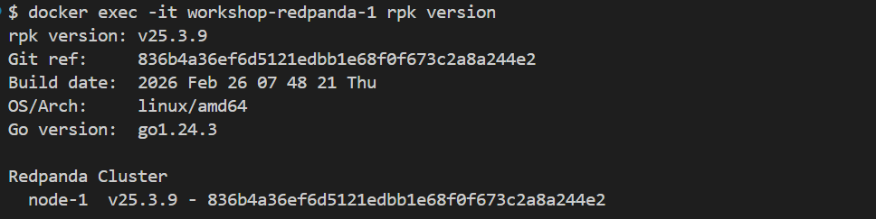
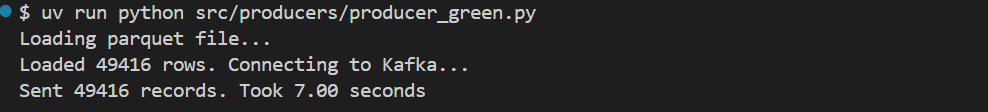
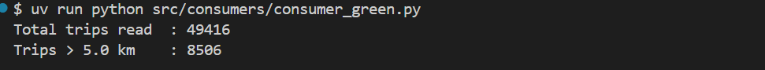
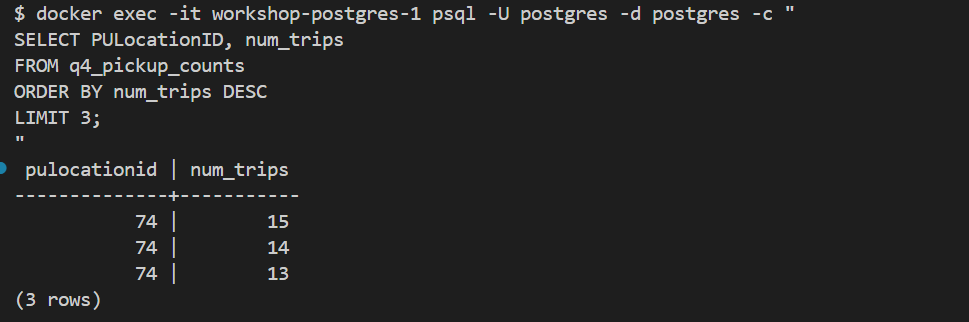
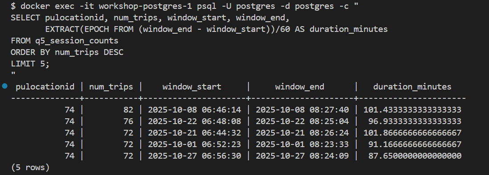
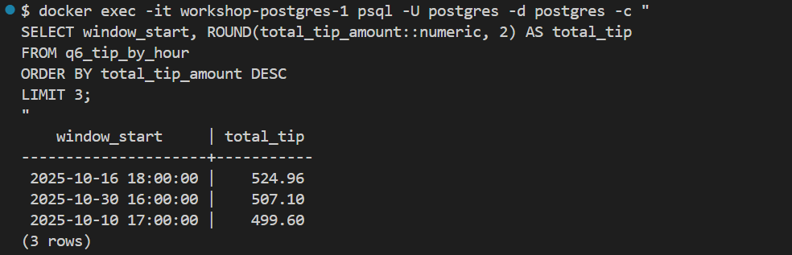

# Homework

In this homework, we'll practice streaming with Kafka (Redpanda) and PyFlink.

We use Redpanda, a drop-in replacement for Kafka. It implements the same
protocol, so any Kafka client library works with it unchanged.

For this homework we will be using Green Taxi Trip data from October 2025:
[green_tripdata_2025-10.parquet](https://d37ci6vzurychx.cloudfront.net/trip-data/green_tripdata_2025-10.parquet)


## Question 1. Redpanda version

Run `rpk version` inside the Redpanda container:

```bash
docker exec -it workshop-redpanda-1 rpk version
```

What version of Redpanda are you running?

### **Answer of Question 1**

The answer is **rpk version: v25.3.9**



## Question 2. Sending data to Redpanda

Create a topic called `green-trips`:

```bash
docker exec -it workshop-redpanda-1 rpk topic create green-trips
```

Now write a producer to send the green taxi data to this topic.

Read the parquet file and keep only these columns:

- `lpep_pickup_datetime`
- `lpep_dropoff_datetime`
- `PULocationID`
- `DOLocationID`
- `passenger_count`
- `trip_distance`
- `tip_amount`
- `total_amount`

Convert each row to a dictionary and send it to the `green-trips` topic.
You'll need to handle the datetime columns - convert them to strings
before serializing to JSON.

Measure the time it takes to send the entire dataset and flush:

```python
from time import time

t0 = time()

# send all rows ...

producer.flush()

t1 = time()
print(f'took {(t1 - t0):.2f} seconds')
```

How long did it take to send the data?

- 10 seconds
- 60 seconds
- 120 seconds
- 300 seconds

### **Answer of Question 2**

The process took only 7 seconds for me, so the nearest answer is **10 seconds**



**Explanation**
1. Create the Kafka topic (`green-trips`)
    ```bash
    docker exec -it workshop-redpanda-1 rpk topic create green-trips
    ```

2. Create Producer python file: [Q2 Producer](../07-streaming/workshop/src/consumers/consumer_green.py) (`workshop/src/producers/producer_green.py`)

3. Run and check the result

    ```bash
    uv run python src/producers/producer_green.py
    ```
    The time printed in the terminal is our answer.

## Question 3. Consumer - trip distance

Write a Kafka consumer that reads all messages from the `green-trips` topic
(set `auto_offset_reset='earliest'`).

Count how many trips have a `trip_distance` greater than 5.0 kilometers.

How many trips have `trip_distance` > 5?

- 6506
- 7506
- 8506
- 9506

### **Answer of Question 3**

The answer is **8506**

**Explanation**

Create Consumer File: ([Q3 Consumer](../07-streaming/workshop/src/consumers/consumer_green.py)) (`workshop/src/consumers/consumer_green.py`)

Run:
```bash
uv run python src/consumers/consumer_green.py
```

The `Trips > 5.0 km` number is our Q3 answer.




> **Note:** `consumer_timeout_ms=10000` makes the script exit automatically instead of hanging forever.


## Question 4. Tumbling window - pickup location

Create a Flink job that reads from `green-trips` and uses a 5-minute
tumbling window to count trips per `PULocationID`.

Write the results to a PostgreSQL table with columns:
`window_start`, `PULocationID`, `num_trips`.

After the job processes all data, query the results:

```sql
SELECT PULocationID, num_trips
FROM <your_table>
ORDER BY num_trips DESC
LIMIT 3;
```

Which `PULocationID` had the most trips in a single 5-minute window?

- 42
- 74
- 75
- 166

### **Answer of Question 4**

The answer is **74**

**Explanation**
1. Create Table
    ```bash
    docker exec -it workshop-postgres-1 psql -U postgres -d postgres -c "
    CREATE TABLE q4_pickup_counts (
        window_start TIMESTAMP,
        PULocationID INTEGER,
        num_trips BIGINT,
        PRIMARY KEY (window_start, PULocationID)
    );
    "
    ```

2. Create a flink job ([Q4 Job](../07-streaming/workshop/src/job/q4_tumbling_location.py): `workshop/src/job/q4_tumbling_location.py`) and run:

    ```bash
    docker exec -it workshop-jobmanager-1 flink run \
        -py /opt/src/job/q4_tumbling_location.py \
        --pyFiles /opt/src -d
    ```
    If any error related to no file detected, try:
    ```bash
    MSYS_NO_PATHCONV=1 \
        docker exec -it workshop-jobmanager-1 flink run \
        -py /opt/src/job/q4_tumbling_location.py -d
    ```

3. Query the table via terminal:
    ```bash
    docker exec -it workshop-postgres-1 psql -U postgres -d postgres -c "
    SELECT PULocationID, num_trips
    FROM q4_pickup_counts
    ORDER BY num_trips DESC
    LIMIT 3;
    "
    ```




The top `PULocationID` is **74** with 15 trips.

## Question 5. Session window - longest streak

Create another Flink job that uses a session window with a 5-minute gap
on `PULocationID`, using `lpep_pickup_datetime` as the event time
with a 5-second watermark tolerance.

A session window groups events that arrive within 5 minutes of each other.
When there's a gap of more than 5 minutes, the window closes.

Write the results to a PostgreSQL table and find the `PULocationID`
with the longest session (most trips in a single session).

How many trips were in the longest session?

- 12
- 31
- 51
- 81

### **Answer of Question 5**

The answer is **81**

**Explanation**
1. Create Table
    ```bash
    docker exec -it workshop-postgres-1 psql -U postgres -d postgres -c "
    CREATE TABLE q5_session_counts (
        window_start TIMESTAMP,
        window_end   TIMESTAMP,
        PULocationID INTEGER,
        num_trips    BIGINT,
        PRIMARY KEY (window_start, window_end, PULocationID)
    );
    "
    ```

2. Create a flink job ([Q5 Job](../07-streaming/workshop/src/job/q5_session_location.py): `workshop/src/job/q5_session_location.py`) and run:

    ```bash
    docker exec -it workshop-jobmanager-1 flink run \
        -py /opt/src/job/q5_session_location.py \
        --pyFiles /opt/src -d
    ```

    If any error related to no py file detected, try:
    ```bash
    MSYS_NO_PATHCONV=1 \
        docker exec -it workshop-jobmanager-1 flink run \
        -py /opt/src/job/q5_session_location.py -d
    ```

3. Query the table via terminal:
    ```bash
    docker exec -it workshop-postgres-1 psql -U postgres -d postgres -c "
    SELECT pulocationid, num_trips, window_start, window_end,
          EXTRACT(EPOCH FROM (window_end - window_start))/60 AS duration_minutes
    FROM q5_session_counts
    ORDER BY num_trips DESC
    LIMIT 5;
    "
    ```




The longest session has 82 trips for me, so the nearest answer is **81** trips.

## Question 6. Tumbling window - largest tip

Create a Flink job that uses a 1-hour tumbling window to compute the
total `tip_amount` per hour (across all locations).

Which hour had the highest total tip amount?

- 2025-10-01 18:00:00
- 2025-10-16 18:00:00
- 2025-10-22 08:00:00
- 2025-10-30 16:00:00

### **Answer of Question 6**

The answer is **2025-10-16 18:00:00**

**Explanation**
1. Create Table
    ```bash
    docker exec -it workshop-postgres-1 psql -U postgres -d postgres -c "
    CREATE TABLE q6_tip_by_hour (
        window_start     TIMESTAMP,
        total_tip_amount DOUBLE PRECISION,
        PRIMARY KEY (window_start)
    );
    "
    ```

2. Create a flink job ([Q6 Job](../07-streaming/workshop/src/job/q6_tip_by_hour.py): `workshop/src/job/q6_tip_by_hour.py`) and run:

    ```bash
    docker exec -it workshop-jobmanager-1 flink run \
        -py /opt/src/job/q6_tip_by_hour.py \
        --pyFiles /opt/src -d
    ```

    If any error related to no py file detected, try:
    ```bash
    MSYS_NO_PATHCONV=1 \
        docker exec -it workshop-jobmanager-1 flink run \
        -py /opt/src/job/q6_tip_by_hour.py -d
    ```

3. Query the table via terminal:

    ```bash
    docker exec -it workshop-postgres-1 psql -U postgres -d postgres -c "
    SELECT window_start, ROUND(total_tip_amount::numeric, 2) AS total_tip
    FROM q6_tip_by_hour
    ORDER BY total_tip_amount DESC
    LIMIT 3;
    "
    ```




The highest total tip amount is 524.96 at **2025-10-16 18:00:00**.

---