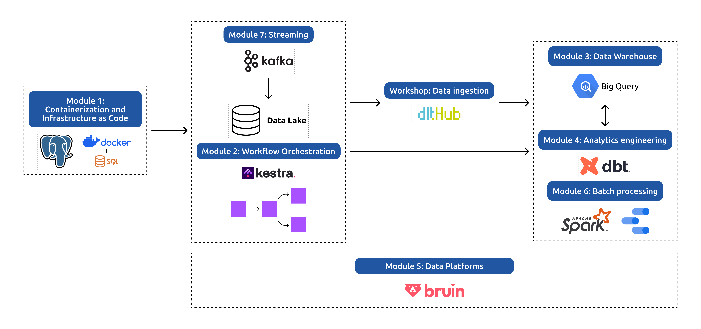

# DE-ZC2026

## Introduction

This repo is my learning journey and repositories for **Data Engineering Zoomcamp** (DataTalks.Club). It will records all of my experiments, homework solution, and project related to the course. 

Data Engineering Zoomcamp is a free, project-oriented data engineering training run by DataTalks.Club. It’s designed to take learners from fundamentals to building production-grade data pipelines using current industry tools and techniques. Check the [website](https://datatalks.club/docs/courses/data-engineering-zoomcamp/) and course [Github repo](https://github.com/DataTalksClub/data-engineering-zoomcamp) for detailed information.

*Course Syllabus*

## Homework

* Module 1 (Docker, SQL, and Terraform): **DONE** ([Solution](Module_01/homework01_solution.md))
* Module 2 (Workflow Orchestration): **DONE** ([Solution](Module_02/homework02_solution.md))
* Module 3 (Data Warehousing): **DONE** ([Solution](Module_03/homework03_solution.md))
* Module 4 (Analytics Engineering): **DONE** ([Solution](Module_04/homework04_solution.md))
* Module 5 (Data Platform): **DONE** ([Solution](Module_05/homework05_solution.md))
* Workshop 1 (Data Ingestion with dlt): **DONE** ([Solution](Workshop/homework/dlt_homework_solutions.md))
* Module 6 (Batch Processing): **DONE** ([Solution](Module_06/homework06_solution.md))
* Module 7 (Streaming): **DONE** ([Solution](Module_07/homework07_solution.md))

## Final Project

*On Progress, deadline Attempt 1 on 31 Mar 2026 and Attempt 2 on 21 Apr 2026*

## Acknowledgement

Special thanks for [Alexey Grigorev](https://www.linkedin.com/in/agrigorev/) as Founder of DataTalks.Club, all the Instructors, contributors, and sponsors who made this learning experience great, challenging, but also enjoyable for all of us.

Big thanks for my learning companion in [Data Enthusiast Community](https://www.linkedin.com/groups/16863051/).

*For your information, some markdown file (README & others), and some code in my repo are created with the help of AI (ChatGPT, Claude, and/or Gemini) using some references from DE Zoomcamp repo and some adjustment from me. For your main references, please visit the main Data Engineering Zoomcamp [Repository](https://github.com/DataTalksClub/data-engineering-zoomcamp)*

**Thanks for your visit**

**Keep Learning!!!**